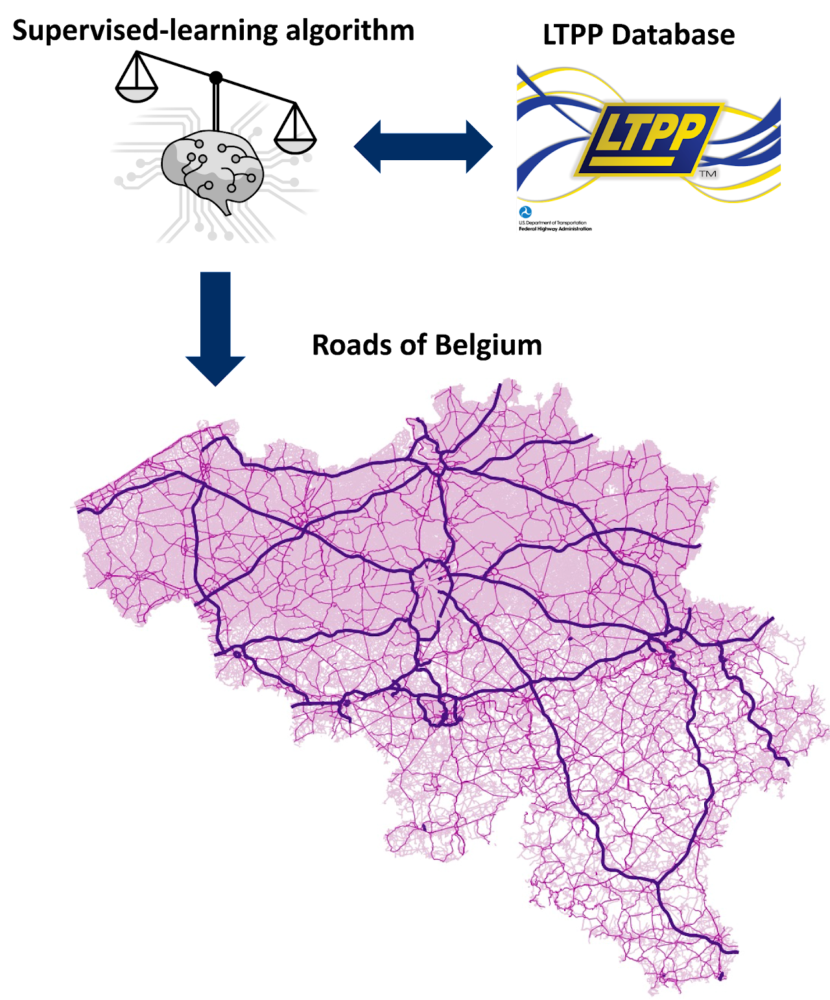

# Systems Analysis For sustainability And climate ResIlience 
# 可持续发展与气候资源的系统分析

自 2023 年起，曹植博士担任中国天津南开大学正教授。在南开大学任职之前，他是比利时安特卫普大学应用工程学院的终身制助理教授。他曾在丹麦南丹麦大学生命周期工程中心进行博士后培训，随后在美国西北大学能源与资源系统分析实验室工作。2017 年，他获得中国科学院博士学位。

曹博士对可持续发展和工业生态学有着广泛的兴趣，尤其擅长开发和应用最先进的可持续发展评估工具，以研究实施低碳技术或政策方案的技术经济可行性。他是一名数学模型爱好者，在工业生态学工具等方面接受过多年培训。

# Creating a resource cadaster for pavements
# 为人行道创建资源清册

建筑环境存量--建筑和交通基础设施--为满足人类的基本需求提供必要的服务，如工作场所、流动性和通信。道路基础设施是建筑环境存量的一个组成部分。它连接并塑造人类住区，确保人们的日常流动、就业和货物配送。道路基础设施在长期使用过程中积累的材料有可能成为未来的资源提供者，这些材料被称为人为材料库存。本项目旨在开发一个可交换的知识和数据平台，以清点路面的 "材料护照"，从而促进路面行业的资源循环利用和循环设计。

# Prospective sustainability assessment
# 前瞻性的可持续性评估